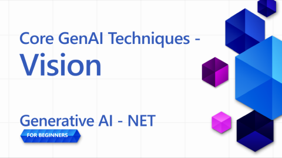
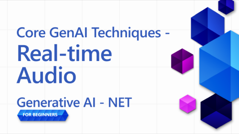

# Vision and Audio AI apps

In this lesson learn how vision AI allows your apps to generate and interpret images. Audio AI provides your apps to generate audio and even transcribe it in real-time.

---

## Vision

[](https://aka.ms/genainnet/videos/lesson3-vision)

_⬆️Click the image to watch the video⬆️_

Vision-based AI approaches are used to generate and interpret images. This can be useful for a wide range of applications, such as image recognition, image generation, and image manipulation. Current models are multimodal, meaning they can accept a variety of inputs, such as text, images, and audio, and generate a variety of outputs. In this case, we are going to focus on image recognition.

### Image recognition with MEAI

Image recognition is more than having the AI model tell you what it thinks is present in an image. You can also ask questions about the image, for example: _How many people are present and is it raining?_

Ok - so we're going to put the model through its paces and ask it if it can tell us how many red shoes are in the first photo and then have it analyze a receipt that's in German so we know how much to tip.


> 🧑‍💻**Sample code**: You can follow [along with sample code here](./src/Vision-01MEAI-GitHubModels/).

1. We're using MEAI and GitHub Models, so instantiate the `IChatClient` as we have been. Also start to create a chat history.

    ```csharp
    IChatClient chatClient = new ChatCompletionsClient(
        endpoint: new Uri("https://models.inference.ai.azure.com"),
        new AzureKeyCredential(githubToken)) // make sure to grab githubToken from the secrets or environment
    .AsChatClient("gpt-4o-mini");

    List<ChatMessage> messages = 
    [
        new ChatMessage(ChatRole.System, "You are a useful assistant that describes images using a direct style."),
        new ChatMessage(ChatRole.User, "How many red shoes are in the photo?") // we'll start with the running photo
    ];
    ```

1. The next part is to load the image into an `AIContent` object and set that as part of our conversation and then send that off to the model to describe for us.

    ```csharp
    var imagePath = "FULL PATH TO THE IMAGE ON DISK";

    AIContent imageContent = new DataContent(File.ReadAllBytes(imagePath), "image/jpeg"); // the important part here is that we're loading it in bytes. The image could come from anywhere.

    var imageMessage = new ChatMessage(ChatRole.User, [imageContent]);

    messages.Add(imageMessage);

    var response = await chatClient.GetResponseAsync(messages);

    messages.Add(response.Message);

    Console.WriteLine(response.Message.Text);
    ```

1. Then to get the model to work on the restaurant receipt - which is in German - to find out how much of a tip we should leave:

    ```csharp
    // this will go after the previous code block
    messages.Add(new ChatMessage(ChatRole.User, "This is a receipt from a lunch. I had the sausage. How much of a tip should I leave?"));

    var receiptPath = "FULL PATH TO THE RECEIPT IMAGE ON DISK";

    AIContent receiptContent = new DataContent(File.ReadAllBytes(receiptPath), "image/jpeg");
    var receiptMessage = new ChatMessage(ChatRole.User, [receiptContent]);

    messages.Add(receiptMessage);

    response = await chatClient.GetResponseAsync(messages);
    messages.Add(response.Message);

    Console.WriteLine(response.Message.Text);
    ```

Here's a point I want to drive home. We're conversing with a language model, or more appropriately a multi-modal model that can handle text as well as image (and audio) interactions. And we're carrying on the conversation with the model as normal. Sure it's a different type of object we're sending to the model, `AIContent` instead of a `string`, but the workflow is the same.

> 🙋 **Need help?**: If you encounter any issues, [open an issue in the repository](https://github.com/microsoft/Generative-AI-for-beginners-dotnet/issues/new).

## Audio AI

[](https://aka.ms/genainnet/videos/lesson3-realtimeaudio)

_⬆️Click the image to watch the video⬆️_

Real-time audio techniques allow your apps to generate audio and transcribe it in real-time. This can be useful for a wide range of applications, such as voice recognition, speech synthesis, and audio manipulation.

But we're going to have to transition away from MEAI and from the model we were using to Azure AI Speech Services.

To setup an Azure AI Speech Service model, [follow these directions](../02-SettingUp.NETDev/getting-started-azure-openai.md) but instead of choosing an OpenAI model, choose **Azure-AI-Speech**.

> **🗒️Note:>** Audio is coming to MEAI, but as of this writing isn't available yet. When it is available we'll update this course.

### Implementing speech-to-text with Cognitive Services

You'll need the **Microsoft.CognitiveServices.Speech** NuGet package for this example.

> 🧑‍💻**Sample code**: You can follow [along with sample code here](./src/Audio-01-SpeechMic/).

1. The first thing we'll do (after grabbing the key and region of the model's deployment) is instantiate a `SpeechTranslationConfig` object. This will enable us to direct the model that we'll be taking in spoken English and translating to written Spanish.

    ```csharp
    var speechKey = "<FROM YOUR MODEL DEPLOYMENT>";
    var speechRegion = "<FROM YOUR MODEL DEPLOYMENT>";

    var speechTranslationConfig = SpeechTranslationConfig.FromSubscription(speechKey, speechRegion);
    speechTranslationConfig.SpeechRecognitionLanguage = "en-US";
    speechTranslationConfig.AddTargetLanguage("es-ES");
    ```

1. Next up we need to get access to the microphone and then new up a `TranslationRecognizer` object which will do the communication with the model.

    ```csharp
    using var audioConfig = AudioConfig.FromDefaultMicrophoneInput();
    using var translationRecognizer = new TranslationRecognizer(speechTranslationConfig, audioConfig);
    ```

1. Finally, we'll call the model and setup a function to handle its return.
   
    ```csharp
    var translationRecognitionResult = await translationRecognizer.RecognizeOnceAsync();
    OutputSpeechRecognitionResult(translationRecognitionResult);

    void OutputSpeechRecognitionResult(TranslationRecognitionResult translationRecognitionResult)
    {
        switch (translationRecognitionResult.Reason)
        {
            case ResultReason.TranslatedSpeech:
                Console.WriteLine($"RECOGNIZED: Text={translationRecognitionResult.Text}");
                foreach (var element in translationRecognitionResult.Translations)
                {
                    Console.WriteLine($"TRANSLATED into '{element.Key}': {element.Value}");
                }
                break;
            case ResultReason.NoMatch:
                // handle when speech could not be recognized
                break;
            case ResultReason.Canceled:
                // handle an error condition
                break;
        }
    }
    ```

Using AI to process audio is a bit different than what we have been doing because we are using Azure AI Speech services to do so, but the results of translating spoken audio to text are pretty powerful.

> 🙋 **Need help?**: If you encounter any issues, [open an issue in the repository](https://github.com/microsoft/Generative-AI-for-beginners-dotnet/issues/new).

We have another example that [demonstrates how to perform real-time audio conversation with Azure Open AI](./src/Audio-02-RealTimeAudio/) - check it out!


## Additional resources

- [Generate images with AI and .NET](https://learn.microsoft.com/dotnet/ai/quickstarts/quickstart-openai-generate-images?tabs=azd&pivots=openai)


## Up next

You've learned how to add vision and audio capabilities to your .NET applications, in the next lesson find out how to create AI that has some ability to act autonomously.

👉 [Check out AI Agents](./04-agents.md).
