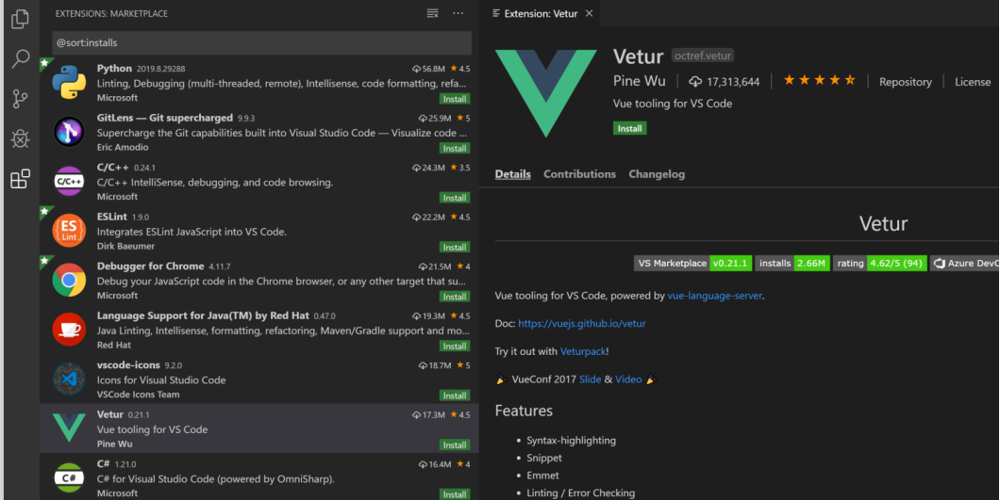

# Visual Studio Code

## Introduzione

[Download Visual Studio Code](https://code.visualstudio.com/download)

Visual Studio Code è un **editor di codice** sorgente **leggero** ma **potente**, altamente **versatile** e ampiamente utilizzato nella comunità degli sviluppatori.

La sua popolarità deriva da una struttura altamente personalizzabile che lo rende adatto a una **vasta gamma di linguaggi di programmazione** e scenari di sviluppo (C++, C#, Java, Python, Go, .NET).

Caratteristiche principali:
* **Open Source**: è disponibile gratuitamente per tutti. 
* **Leggero ed efficiente**: ideale per eseguire applicazioni su una varietà di sistemi operativi e hardware. 
* **Estensioni**: l’IDE ha una grande libreria di estensioni utili per personalizzare l'ambiente e coprire una vasta gamma di funzionalità
* **Debug**: funzionalità di debugging di alta qualità, semplificano il processo di individuazione degli errori e danno accesso a funzionalità avanzate come il tracciamento delle variabili e lo stack delle chiamate.

## Interfaccia utente

- **Editor**: schermata principale è qui che si scrive e modifica il codice sorgente. 
- **Activity Bar**: si trova sul lato sinistro dell'editor. Consente di switchare la **Side Bar** tra varie sezioni, ognuna con le proprie funzionalità.
- **Barra di Stato**: nella parte inferiore dell'editor. Fornisce informazioni importanti sul progetto aperto e i file che si stanno modificando.
- **Pannelli Inferiori**: integra un terminale e contiene le informazioni di output, di debug, errori e warnings di progetto.

## Keyboard shortcuts

Visual Studio Code è facilmente accessibile tramite la tastiera. 

**Command Palette**: è un accesso rapido a tutte le funzionalità dell’editor. È come una scatola magica che ti permette di eseguire una vasta gamma di comandi direttamente dalla tastiera. è un vero e proprio hub di controllo interattivo. Per aprirla si utilizza Ctrl+Shift+P, una delle combinazioni di tasti più importanti.

[Lista di tutte le shortcuts](https://code.visualstudio.com/docs/getstarted/keybindings#_keyboard-shortcuts-reference)

## Estensioni

Le estensioni di VS Code ti consentono di aggiungere linguaggi, debugger e strumenti alla tua installazione. 

VS Code consente agli autori di estensioni di integrarsi direttamente nell'interfaccia utente e di integrare funzionalità attraverso le stesse API utilizzate da VS Code. 

- Cliccare sull'**icona delle estensioni** nella barra laterale o usare il comando "**Visualizza: Estensioni**"  (Ctrl+Shift+X).
- **Ricerca** di estensioni tramite il **campo di ricerca**.
- Fare clic su "**Installa**" accanto all'estensione desiderata. 

- Gestione delle Estensioni
    - Disabilitare estensioni non utilizzate per mantenere leggero l'editor. 
    - Rimuovere estensioni non più necessarie.

### Estensione AL Language

Installiamo l'estensione per il linguaggio AL. 

**Linguaggio AL**: linguaggio di programmazione per modificare business central. Creiamo un nuovo progetto con il comando **AL:GO** dalla Command Palette.

## Riferimenti
* [Visual Studio Code](https://code.visualstudio.com/)
* [AL Language](https://marketplace.visualstudio.com/items?itemName=ms-dynamics-smb.al)
* [Keyboard Shortcuts](https://code.visualstudio.com/docs/getstarted/keybindings#_keyboard-shortcuts-reference)