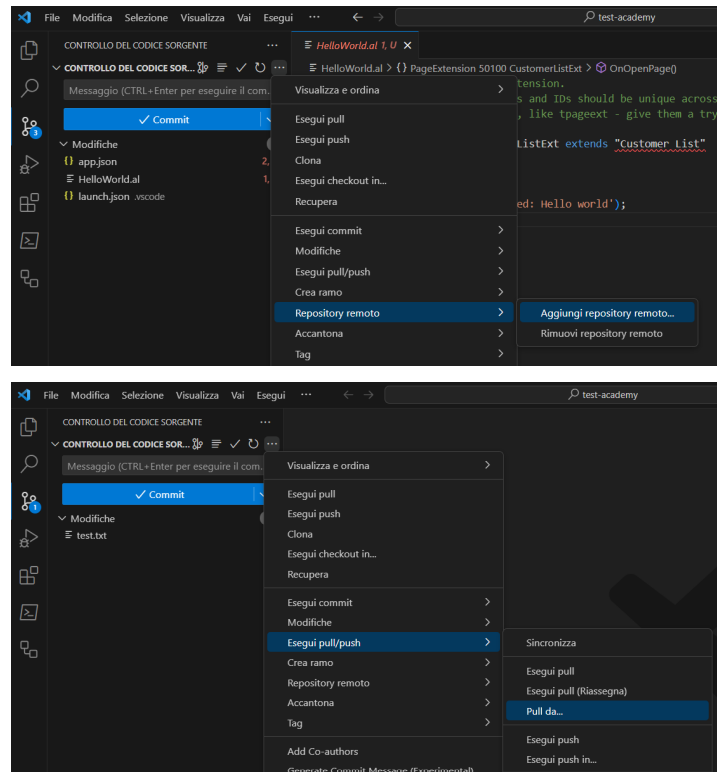

# Git

## Introduzione

[Download Git](https://git-scm.com/downloads)

Git è un sistema di controllo delle versioni distribuito, progettato per tenere traccia delle modifiche apportate al codice sorgente di un progetto software.

- **Tracciamento delle modifiche**: consente di registrare ogni modifica al codice, chi l'ha apportata e quando. Questo è fondamentale per la gestione del ciclo di vita del software. 
- **Collaborazione Efficiente e Remota**: più sviluppatori e team distribuiti possono lavorare contemporaneamente su un progetto, gestendo le proprie modifiche in autonomia. 
- **Controllo delle Versioni**: permette di gestire diverse versioni del software in modo organizzato. 
- **Risparmio di Tempo**: facilita la fusione di modifiche, riducendo il tempo speso nelle attività di sviluppo. 
- **Sicurezza dei Dati**: assicura che il codice sorgente sia ripristinabile in caso di errori o perdita di dati. 
- **Integrazione con Strumenti di Sviluppo**: è integrato con una vasta gamma di strumenti, tra cui IDE e servizi hosting come GitHub, GitLab e Bitbucket.

## Repository

**Repository (Repo)**: è una directory di lavoro o uno spazio di archiviazione in cui viene conservato l'intero **storico delle modifiche** del progetto. Il repository è il cuore di Git, dove tutti i file, le cartelle e le modifiche vengono registrati e conservati. 

 

**Repository Locale**: è una directory sul tuo computer in cui Git conserva tutte le informazioni relative al tuo progetto, tra cui la cronologia delle modifiche (commit), i branch e i file.
Il repository locale **è la tua copia di lavoro** del progetto, dove puoi apportare modifiche, crearne di nuove e mantenere uno storico completo del codice. 

**Repository Remoto**: è una copia del tuo repository locale che **risiede su un server remoto** o in un servizio di hosting Git come GitHub, GitLab o Bitbucket. Il repository remoto è **condiviso con altri membri** del team ed è utilizzato per collaborare, sincronizzare e condividere il codice sorgente.

## Git Flow

Il flusso di lavoro principale consente di registrare e condividere le modifiche in modo organizzato:

1. **Add** (Aggiungi): la prima fase è l'aggiunta delle modifiche alla "staging area" utilizzando il comando _git add_.
2. **Commit** (Registra): dopo aver selezionato le modifiche, si esegue il commit utilizzando il comando _git commit_. Questo crea uno snapshot delle modifiche selezionate e le registra nel repository locale con un messaggio descrittivo. 
3. **Push** (Carica): per condividere le modifiche con gli altri membri del team o con il repository remoto, si utilizza il comando _git push_. Questo carica i commit locali nel repository remoto, mantenendo sicronizzati i repository locale e remoto. 

## Comandi Principali

- **git init**: viene utilizzato per inizializzare un nuovo repository Git locale in una directory esistente.

- **git clone**: viene utilizzato per creare una copia completa di un repository Git remoto sul proprio computer, consentendo di lavorare in modo indipendente sul progetto.

- **git commit**: un commit è uno snapshot istantaneo delle modifiche apportate al codice in un determinato momento. Ogni commit ha un messaggio descrittivo. Il comando è utilizzato per registrare le modifiche nel repository locale dopo averle preparate con git add, consentendo il tracciamento nel tempo.

- **git push**: consente di inviare i commit locali al repository remoto, sincronizza i repository rendendo le modifiche disponibili per altri membri del team.

- **git pull**: serve per recuperare e incorporare le modifiche dal repository remoto nel repository locale.
- **git branch**: un branch è una linea di sviluppo separata all'interno di un repository. Consente di lavorare su  nuove funzionalità o correzioni di bug senza influire sul codice principale. I branch permettono lo sviluppo parallelo e la gestione delle modifiche in modo isolato prima di unirle al codice principale. Il comando viene utilizzato per visualizzare, creare o eliminare branch all'interno di un repository Git.
- **git merge**: serve per eseguire il merge, cioè il processo di unione delle modifiche da un branch all’altro, integrando le modifiche del branch di origine in quello di destinazione.
- **git checkout**: comando che serve per cambiare branch.

<!-- ## Branch e Merge
Lasciare da fare a Thomas 
Guarda https://code.visualstudio.com/docs/sourcecontrol/overview -->

## Esempio linea di comando

Creare e sincronizzare un repository locale e remoto:

1. Creare un repository su github tramite: [GitHub](https://github.com/new)

2. Inserire il nome del repository **_my-repo_** e cliccare su «**Create repository**»

3. Aprire il terminale e posizionarsi su una cartella dove creare il repository

4. Clonare il repository remoto tramite: `{/git clone<URL_repository>/}`

5. All’interno del repository locale creare un file di testo chiamato **README.md**

6. Scrivere dentro il file: **# HELLO WORLD**

7. Aggiungere il file README alla staging area: **_git add_ README.md**

8. Eseguire il commit delle modifiche tramite:  **_git commit_ -m "Aggiunto il file README"**

9. Pusha il commit nel repository su GitHub: **_git push_ origin main**

## Integrazione con Visual Studio Code

Adesso che abbiamo sia un progetto locale che un repository remoto proviamo a sincronizzarli:

 

1. **Aprire il progetto di VS Code** creato in precedenza: lo pubblicheremo su github

2. Andare nel tab di Git e quindi cliccare su «**Inizializza repository**»

3. Come mostrato nella prima foto **aggiungere un repository remoto**

4. Come mostrato nella seconda foto eseguire il «**Pull da**» e scegliere il branch main (l’unico esistente)

5. Tornare nel tab dell’esplora file e vedere se il file README.md è stato aggiunto

6. Tornare nel tab git, **inserire un messaggio di commit** e cliccare su commit

7. **Pushare il tutto** con lo stesso pulsante

## Riferimenti
* [Git](https://git-scm.com/)
* [Git in VS Code](https://code.visualstudio.com/docs/sourcecontrol/overview)